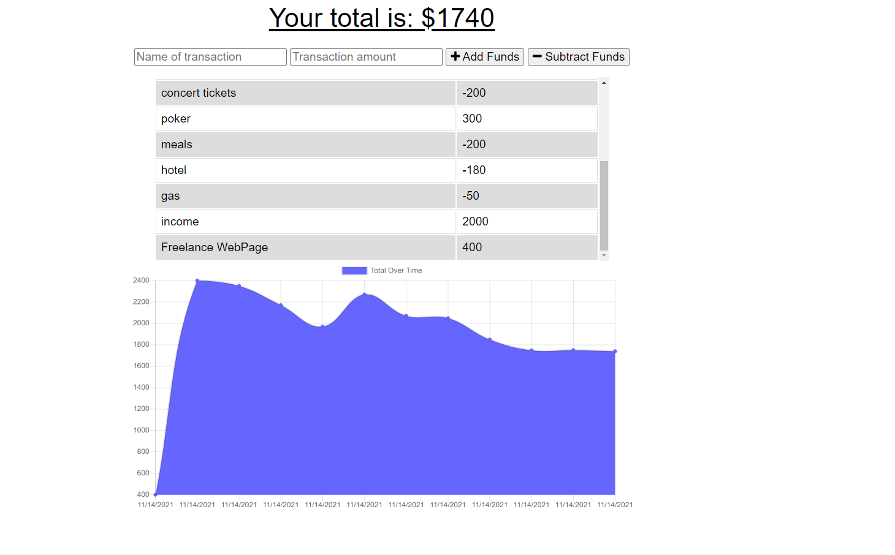

## <Budget-Tracker-Offline>

## Table of Contents

  - [Description](#description)
  - [Installation](#installation)
  - [Usage](#usage)
  - [Credits](#credits)
  - [GitHub](#github)
  - [Features](#features)

## Description

This application will allow an avid traveller record their transactions even if they are offline.
When offline, the application will store the data in an IndexDB temporal database and, when connection is restablished, it will automatically send the data to a MongoDB Cloud database.

The application is deployed in Heroku and is connected to the MongoDB Cloud Atlas database via a Mongoose connection object.

## Installation

No installation is needed. This application is run in a live webpage.

## Usage

To use this application, go to the deployed webpage by followig this link: [Visit the deployed page](https://budget-tracker-ajp.herokuapp.com/)

Once in the landing page, type in a name of the transaction, a value and click on the corresponding button if it is an income or an expense. The transaction summary table and graph below will update automatically.

## Credits

- [npm](https://www.npmjs.com/)
- [sequelize-npm](https://www.npmjs.com/package/sequelize)
- [ExpressJs](https://expressjs.com/)
- [Heroku](https://www.heroku.com/nodejs)
- [MongoDB](https://cloud.mongodb.com/)
- [MongooseJS](https://mongoosejs.com/)  
- [Robo 3T](https://robomongo.org/download)

Reference material:
- [w3schools](https://www.w3schools.com/)
- [StackOverflow](https://stackoverflow.com/)
- [Mozilla Developer Network](https://developer.mozilla.org/en-US/)

## GitHub

If you want to know more details, feel free to [visit the repo](https://github.com/aj-pena/Budget-Tracker-offline.git)

## Features

BackEnd:
- Heroku
- Object Oriented Programming
- Model View Controller framework
- Node.js
- MongoDB
- Robo 3T  

